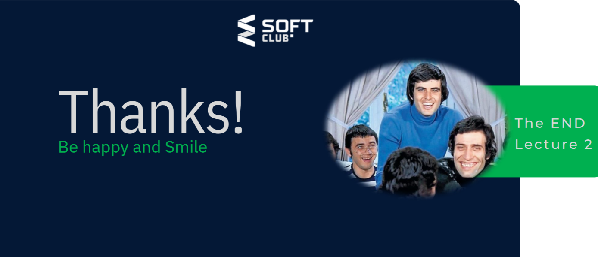

# What is ReCursion in JavaScript ?
##### Рекурсия вақте ки функсия худашро даъват мекунад, то он даме, ки касе онро қатъ кунад Функсияҳои алтернативии курссивӣ. Аммо баъзе забонҳо ба монанди пӯшидан ягон гардиш надоранд изҳорот, шумо бояд такрори курсиро такроран иҷро кунед, ки як порчаи кодро иҷро кунед. Агар касе онро боздорад, пас он хоҳад буд такрор кардан (худро даъват кардан) абадан. Функсияҳои рекурсивӣ ба шумо имкон медиҳанд, ки воҳиди корро чанд маротиба иҷро кунед. Забонҳои муосири барномасозӣ, ба монанди JavaScript, аллакай барои ва дар айни замон дорои хусусиятҳо мебошанд р е к у р с и о н. Функсияи рекурсивӣ бояд шарте дошта бошад, ки занги худро қатъ кунад. Дар акси ҳол, ба функсия ба таври номуайян даъват карда мешавад. Пас аз иҷро шудани шарт, функсия занги худашро қатъ мекунад. Ин асос номида мешавад ҳолати. Барои пешгирии рекурсияи беохир, шумо метавонед изҳороти if...else (ё равиши шабеҳ) -ро истифода баред. ки як шоха занги рекурсиви мекунад, дигараш не.

# what is Clousure in JavaScript ?
#####  Aclosure ин маҷмӯаи функсияест, ки бо истинод ба он муттаҳид карда шудааст (дар замима). ҳолати атроф (муҳити лексикӣ). Ба ибораи дигар, басташавӣ ба шумо медиҳад дастрасӣ ба доираи функсияи берунӣ аз функсияи дохилӣ.

